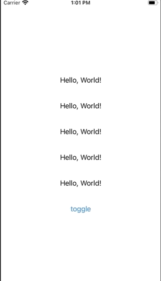

# Poptip

A simple poptip style `ViewModifier` in SwiftUI, demonstraing the use of `PreferenceKey` and `EnvironmentKey` to make a custom viewModifier that behaves idiomatically like the framework modifiers. 

